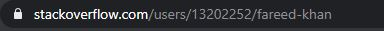

<h1>Stackoverflow Profile embedding</h1>

<p>If you want to change the code based on your need then you can download the repo which include the js file and html with it.</p>
<hr>

<h3>Step 1</h3>
<p>Get your Profile ID and remember your's as we are going to use it in the last step.</p>
<p>for example: My user profile ID is 13202252</p>


<hr>

<h3>Step 2</h3>
<p>Import this Css file in your head tag for styling the profile div</p>

```css
<link rel="stylesheet" href="https://unpkg.com/github-calendar@latest/dist/github-calendar-responsive.css" />
```
<p>This css file is taken from another repository which is used to embed github contribution graph on your website. Here is
  the link to that repository:

  [Github Calender Embed](https://github.com/Bloggify/github-calendar)

</p>

<hr>

<h3>Step 3</h3>
<p>Copy this html code and paste it in your html page where you want to show your profile.</p>


```html
<div>
  <h5>Stack overflow Profile</h5>
  <div style="border: 1px solid #DDDDDD;">
    <div class="contrib-column table-column">
      <span class="text-muted head">Reputation</span>
      <span class="contrib-number" id="repu"></span>
    </div>
    <div id="stack">
    </div>
  </div>
</div>
```

<hr>

<h3>Step 4</h3>
<p>Add these script tags at the bottom of your page and replace the value of the variable user_id  with your profile ID.</p>

```html
<!-- profile ID mentioned in step 1 -->
<script>
  user_id = "13202252";
</script>

<!-- CDN Script tag -->
<script src="https://drive.google.com/uc?id=1y6wwiuaWu-EDbH_x6z616LkkWTA1_LN1"></script>
<!-- CDN Script tag -->
```
<hr>
<p style="color: red;">This project is created with the help of free stackoverflow user-profile api. So you can call limited number of times through this API per day.</p>

<p style="color: red;">So it will be really great if you can integrate it in final stage but not in development stage of your project.</p>
